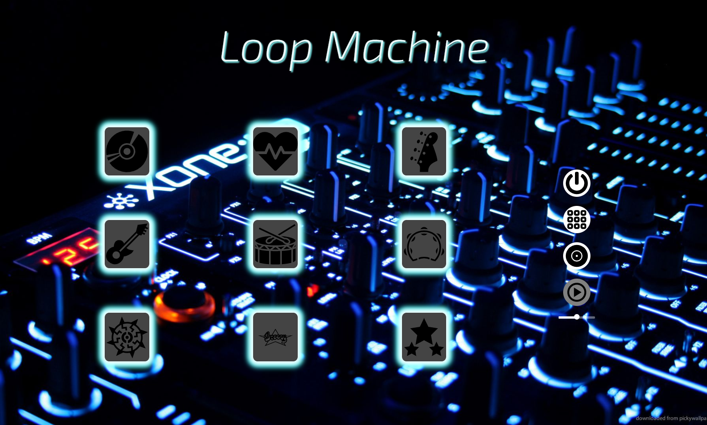

# Loop Machine
## Enjoy The Loop Machine Service!
    this is a repository of a Loop Machine service.
    the service offers 9 beats you can control and looping.
    the service also provides a record of of playing.
###
the repository includes client side of React app with usage of React package - "react-icons".  
the repository use state management of the package "recoil".

## Loop Machine
    the Loop Machine contains 9 different beats you can control and play. the machine will add played beats on the next loop played.

## Controller
    In the controller you can see the options you can do with the Loop Machine.  
    The first option is start playing loop. The second option is play all beats together, the third is record, and the fourth is play the last record.  
    you also can control the speed of the Loop Machine in the slider.

## Beats
    The beats in the Loop Machine will change their look when you change the play state of them.
    Played beats will be green, future played beats will be yellow, and unplayed beats will be blue.
    If you change your opinion about a beat, you can turn him of immediately, and if the loop is a future played beat he will still be yellow, but with dark background, so you can see if it will play in the next loop or will not.

## Responsive
    the service is responsive and can be use on desktop and mobile devices.

Enjoy :)
